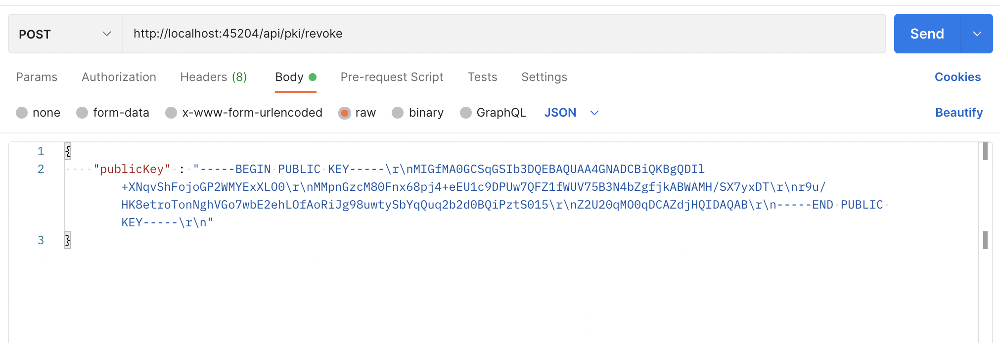

## The steps to run the app:
- npm install
- npm start

## The Apis:
### To create new a PKI: 
**Get** http://localhost:45204/api/pki/createPKI
### To get list of PKIs: 
**Get** http://localhost:45204/api/pki/getAll
### To revoke a PKI: 
**Post** http://localhost:45204/api/pki/revoke  
***With a body of the following form:***
{
    "publicKey" : <The public key needs to be revoked>
}
***Example:***


### To sign a message: 
**Post** http://localhost:45204/api/pki/sign 
***With a body of the following form:***
```json
{
    "message" : <Thông điệp cần ký>,
    "publicKey": <Khóa công khai>,
    "privateKey": <Khóa bí mật>
}
```
### To verify the signature on a message
**Post** http://localhost:45204/api/pki/verify  
***With a body of the following form:***
```json
{
    "SIGN": {
        "message": <Thông điệp>,
        "publicKey": <Khóa công khai>,
        "signature": <Chữ ký trên thông điệp>
    }
}
```