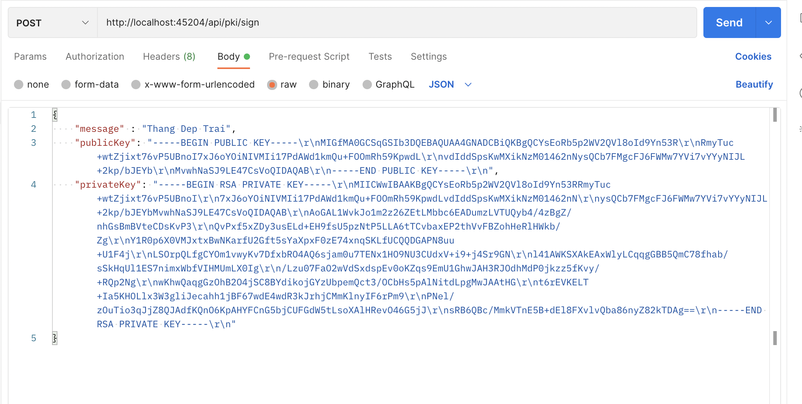
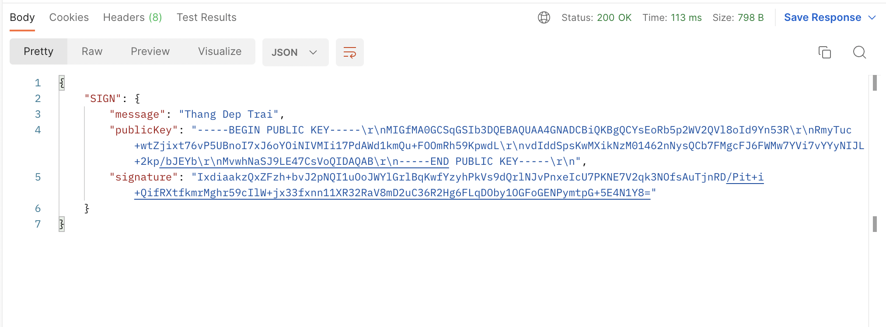
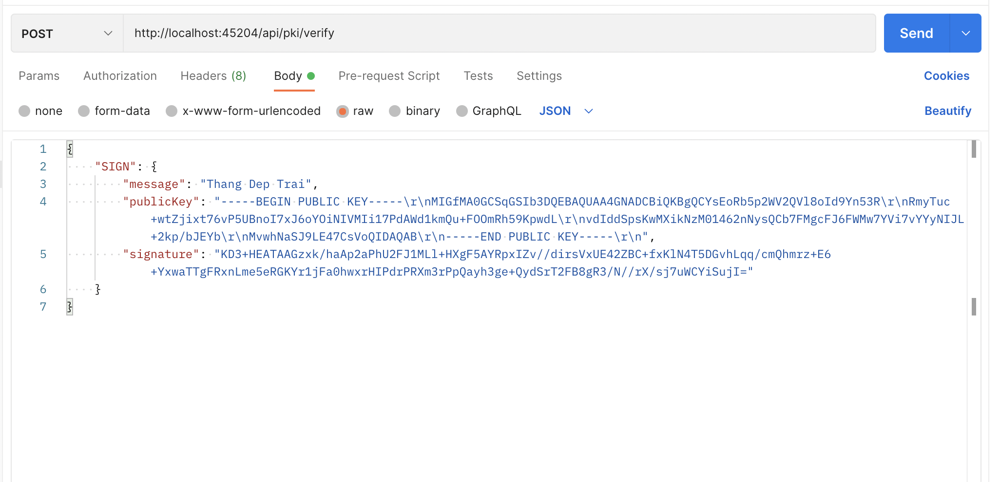

## The steps to run the app:
- npm install
- npm start

## The Apis:
### To create new a PKI: 
**Get** http://localhost:45204/api/pki/createPKI
### To get list of PKIs: 
**Get** http://localhost:45204/api/pki/getAll
### To revoke a PKI: 
**Post** http://localhost:45204/api/pki/revoke  
***With a body of the following form:***
```json
{
    "publicKey" : < The public key needs to be revoked >
}
```
***Example:***


### To sign a message: 
**Post** http://localhost:45204/api/pki/sign 
***With a body of the following form:***
```json
{
    "message" : < Message to sign >,
    "publicKey": < Your public key >,
    "privateKey": < Your private key >
}
```
***Example:***

***The result returned when signing successfully will be in the form:***

### To verify the signature on a message
**Post** http://localhost:45204/api/pki/verify  
***With a body of the following form:***
```json
{
    "SIGN": {
        "message": < Message >,
        "publicKey": < Your public key >,
        "signature": < Your public key >
    }
}
```
***Example:***
